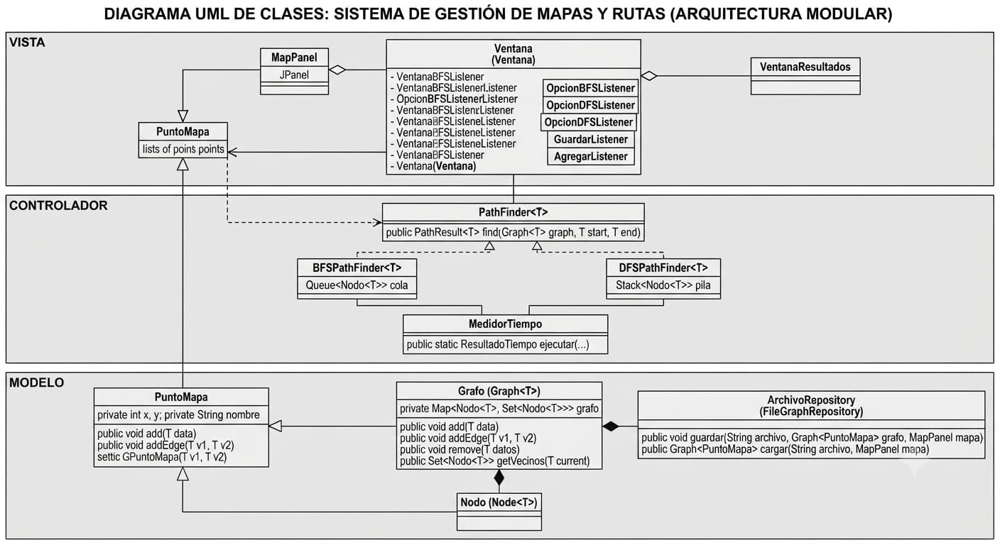
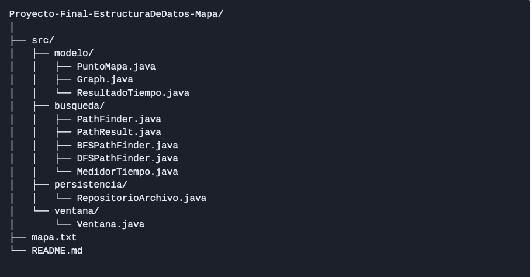
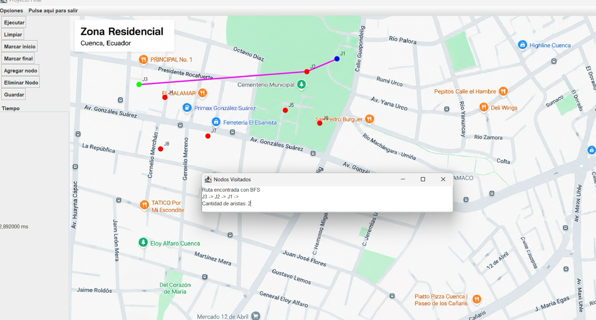
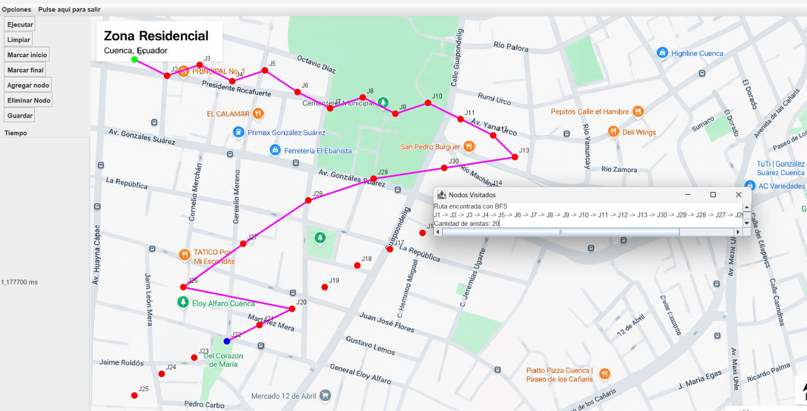

# Proyeco final  -- Mapa -- Busqueda con BFS y DFS

# Nombres
- `Christian Villa`
- `Bryam Collaguazo`
## Correos institucionales
`bcollaguazov@est.ups.edu.ec`

`cvillam2@est.ups.edu.ec`
##          Índice General
1. Objetivo del Proyecto
2. Descripción del Problema
3. Marco Teórico (Grafos, BFS y DFS)
4. Tecnologías Utilizadas
5. Diagrama UML y Explicación
6. Arquitectura y Estructura de Carpetas
7. Explicación General del Funcionamiento
8. Capturas de Configuraciones de Mapas
9. Ejemplo Comentado y Explicado de Algoritmos
10. Tabla Comparativa de Resultados
11. Conclusión Individual
12. Recomendaciones y Aplicaciones Futuras


## 1.  Objetivo

Desarrollar una aplicación en Java bajo un entorno gráfico (Swing) que permita
crear un sistema de mapas mediante estructuras de datos llegadas a ser basadas en grafos, implementando y
comparando algoritmos de búsqueda (BFS y DFS) para encontrar rutas mejores o caminos
válidos entre puntos específicos, midiendo de forma precisa el rendimiento tmeporal de cada uno.
## 2. Descripción del Problema
En los sistemas de navegación como el google maps, la representación ubicaciones y calles se utiliza la logica de un grafo, donde los cruces o puntos de interés llegan a ser como vértices (nodos) y las
Sistema de Mapas y Rutas - BFS y DFS 2
vías o conexiones directas actúan como aristas. El problema principal es determinar caminos confibales
de manera eficiente entre un nodo de inicio y un nodo final. Este proyecto llega a tener en cuenta la necesidad de
construir una herramienta visual que permita al usuario o en este caso a nostros crear, borrar, persistir y analizar mapas aplicando algoritmos fundamentales de recorrido de grafos como el BFS Y DFS.
## 3. Marco Teórico
## Grafos
Un grafo es una estructura discreta compuesta por un conjunto de nodos V y un conjunto
de aristas que conectan los vértices. En este proyecto se emplean grafos no ponderados
con representación para modelar mapas.

## Búsqueda en Anchura (BFS - Breadth-First Search)
BFS es un algoritmo de búsqueda que explora el grafo nivel por nivel. Utiliza una estructura de
datos tipo cola (Queue) bajo el principio FIFO (First-In, First-Out). En términos de rutas, BFS garantiza
encontrar el camino con la menor cantidad de aristas (camino más corto).
## Búsqueda en Profundidad (DFS - Depth-First Search)
DFS explora lo más profundo posible a lo largo de cada rama antes de retroceder (backtracking). Utiliza una
estructura de pila (Stack) o llamadas recursivas basadas en LIFO. Es útil para verificar la conectividad general,
aunque no garantiza el camino con menor número de aristas.

## 4. Tecnologías Utilizadas
• Visual Studio 
• Interfaz Gráfica: Java Swing (JFrame, JPanel, JButton, JTextArea)
•Persistencia de Datos: Archivos de texto plano estructurados (mapa.txt) para leerlos 
•Logica del BFS y DFS

## 5. Diagrama UML y Explicación

## 1.⁠ ⁠Capa Modelo (modelo)
Es el núcleo lógico de la aplicación. Representa los datos y las estructuras fundamentales para el programa.

*PuntoMapa:* tiene las coordenadas y el nombre de cada vértice dentro del mapa. Contiene atributos privados como x, y y nombre, protegidos mediante métodos encapsulados (getters y setters).

*Grafo (Graph<T>):* Es la estructura de datos principal que almacena los nodos y las conexiones. Utiliza un mapa (Map) para relacionar cada nodo con su conjunto de vecinos, permitiendo añadir nodos, conectar puntos y consultar uniones.

*persistence:* Gestiona la persistencia de los datos. guarda el estado del grafo y la configuración de los mapas en archivos del sistema y de cargarlos nuevamente.

## 2.⁠ ⁠Capa Controlador / Lógica de Algoritmos (controlador)

Contiene los algoritmos de búsqueda y las herramientas de medición de rendimiento que procesan la información del modelo.

*PathFinder<T>:* Interfaz o clase base que define la firma común para los algoritmos de búsqueda de rutas (find).

*BFSPathFinder y DFSPathFinder*: Implementan las estrategias de recorrido sobre el grafo.

*BFS (Breadth-First Search / Búsqueda en Anchura):* Utiliza una Cola (Queue) para explorar los nodos nivel por nivel, garantizando encontrar el camino con menor número de saltos.

*DFS (Depth-First Search / Búsqueda en Profundidad)*: Utiliza una Pila (Stack) para explorar los caminos tan hondo como sea posible antes de retroceder.

*MedidorTiempo:* Clase utilitaria encargada de registrar de manera precisa el tiempo de ejecución de los algoritmos.

## 3.⁠ ⁠Capa Vista / Interfaz Gráfica (vista)
Se encarga de la interacción directa con el usuario final.

*Ventana:* Contiene la estructura principal de la aplicación (barra de menús, botones de control para iniciar BFS/DFS, agregar nodos o gestionar archivos). Utiliza patrones de escucha de eventos (Listeners) para reaccionar a las acciones del usuario.

*MapPanel*: Un componente visual personalizado (JPanel) donde se dibujan interactivamente los nodos, las aristas y las rutas calculadas sobre el mapa.

*VentanaResultados*: Una ventana secundaria dedicada exclusivamente a mostrar de forma clara los resultados de las ejecuciones, como la lista de nodos visitados y el tiempo transcurrido.

## 6. Arquitectura y Estructura de Carpetas



## 7. Explicación General del Funcionamiento
## 1.
Modo Agregar: Hacer clic en el mapa para registrar nuevos nodos con coordenadas (x, y).
## 2.
Definir Inicio y Fin: Seleccionar nodos de origen y destino para las rutas.

## 3.
Ejecutar Algoritmos: Acceder al menú de búsqueda para evaluar BFS o DFS. El sistema calcula la ruta,
actualiza la interfaz visual con los trazos correspondientes, muestra la cantidad de aristas recorridas y
mide el tiempo exacto de ejecución en milisegundos.
## 4.
Persistencia: Guardar o cargar la configuración completa de nodos y aristas desde el archivo mapa.txt.
## 8. Capturas de Configuraciones de Mapas

Evaluada para verificar la eficiencia rápida de
ambos algoritmos en mallas sencillas.


Evaluada con múltiples
ramificaciones para verificar la profundidad de búsqueda en DFS frente a la optimización en anchura de BFS.

## 9. Ejemplo Comentado y Explicado de Algoritmos
``` java
@Override
public PathResult<T> find(Graph<T> graph, T start, T end) {

    // Estructuras de datos principales para el algoritmo
    Stack<T> pila = new Stack<>();          // Almacena los nodos pendientes por visitar (LIFO: último en entrar, primero en salir)
    Set<T> visitados = new HashSet<>();     // Registra los nodos que ya han sido procesados para evitar ciclos
    Map<T, T> padre = new HashMap<>();      // Mapea cada nodo con su predecesor para poder reconstruir el camino al final

    // Paso inicial: colocamos el nodo de inicio en la pila
    pila.push(start);

    // Bucle principal: se ejecuta mientras haya nodos por explorar en la pila
    while (!pila.isEmpty()) {

        // Extraemos el último nodo agregado a la pila
        T actual = pila.pop();

        // Verificamos si el nodo actual aún no ha sido visitado
        if (!visitados.contains(actual)) {

            // Marcamos el nodo como visitado
            visitados.add(actual);

            // Condición de parada: si encontramos el nodo de destino, interrumpimos la búsqueda
            if (actual.equals(end)) {
                break;
            }

            // Recorremos todos los vecinos del nodo actual obtenidos del grafo
            for (Node<T> vecino : graph.getVecinos(actual)) {

                T datoVecino = vecino.getDatos();

                // Si el vecino aún no ha sido visitado, lo registramos para explorarlo
                if (!visitados.contains(datoVecino)) {

                    // Guardamos quién es el padre (nodo actual) del vecino para reconstruir el camino
                    padre.put(datoVecino, actual);
                    
                    // Añadimos el vecino a la pila para explorarlo posteriormente
                    pila.push(datoVecino);
                }
            }
        }
    }

    // Una vez encontrado el destino (o vaciada la pila), reconstruimos la ruta seguida desde 'start' hasta 'end'
    List<T> camino = reconstruirCamino(padre, start, end);

    // Retornamos el resultado que contiene los nodos visitados y el camino final encontrado
    return new PathResult<>(visitados, camino);
}
```


## Tabla Comparación de BFS y DFS

| Caso | Algoritmo | Inicio | Destino | Nodos visitados | Cantidad de aristas | Tiempo |
|:----:|:---------:|:------:|:-------:|:---------------:|:-------------------:|:-------:|
| 1 | BFS |C |D4 |13 | 12| 2,225708 ms|
| 1 | DFS | C| D4| 9|9 |0.361291 ms |
| 2 | BFS | C1|B18 | 15| 14| 0,397538 ms|
| 2 | DFS | C1| B18| 38| 37| 4,044542 ms|
| 3 | BFS |C1 | D2| 11|10 |0,107917 ms |
| 3 | DFS |C1 | D2| 33| 32|0,723417 ms |

*¿Qué diferencias se observaron en el orden de exploración de BFS y DFS?*

BFS(Busqueda por anchura) este llega a explocar cada grafo por nivel, primero va vistandio a todos los vecinos que esten a su alcance antes de irse alejando. Esto llega a reflejar que revisa un numero de nodos envase a su anchura para encontar un camino mas corto.

*DFS (Búsqueda en Profundidad):*       Este llega a lo profundo de la rama antes de ir retrocediendo. Por este motivo en el caso 2,3, el DFS llega a exploraar muchos mas nodos(38,33 respectivamente) porque primero se va por un camino largo antes de llegar o encontar el destino

*¿BFS encontró una ruta con menor cantidad de aristas en todos los casos evaluados?*

Si excepto en el primer caso, llego a obtener una ruta con 12 aristas en comparacion con el DFS que obtuvo 9.
Pero en el caso 2 y 3 se obtuvo que BFS usaba 14 aristas frente a las 37 del DFS y 10 aristas frente a las 32 de DFS.
En conlcusion se podria decir que el BFS simpre va a ser una herramienta que nos va a garanticar un menor numero de aristas para encontrar el camino mas corto


*¿DFS encontró rutas diferentes a las obtenidas con BFS?*

Si, se puede decir que en la tabla se evidencia la cantidad de aristas de los casos 2,3 y la diferencia en la cantidad de nodos visitados en el caso 1. Como DFS llega a tener una profundidad para encontrar el camino estas llegan a ser mas largar y distintas comparadas con la de BFS

*¿Qué algoritmo visitó más nodos en cada caso?*

Caso 1: BFS visitó más nodos 13 nodos en comparación con DFS 9 nodos.

Caso 2: DFS visitó más nodos 38 nodos en comparación con BFS 15 nodos.

Caso 3: DFS visitó más nodos 33 nodos en comparación con BFS 11 nodos.


*¿Los tiempos de ejecución fueron suficientes para determinar cuál algoritmo es mejor?*

No relamente, ya que al momento de volver a ejecutar se cambiaba el tiempo y es un poco confuso por esa parte.
Si se  llega a buscar un camino corto con una menor cantidad de aristas BFS llego a demostar una superioridad en los casos 2 y 3 auque sus tiempos lleguen a variar

Si se llega a buscar un menor uso de la memoria en ciertos recorridos por profundidad DFS puede llegar a registrar en cierto casos, como en el 1 con 0,36 ms frnte 2,33 ms BFS.


*¿Cómo influyó la estructura del grafo en el comportamiento de cada algoritmo?*

La estructura implementada en el grafo basado en la lista utilizando un HasMap con Hasset que implementa los vecinos, llegó a optimitar el rendimiento gracias a que nos dio un acceso O(1) a las conexiones, llegando a influir en BFS y DFS de la siguiente manera:

*BFS:* llego a explorar los nivkes llegando a utilizar una cola. Al llegar a ser un grafo no ponderado, su estructura llego a permitir que simpre encontrara el camino con menor cantidad de aristas.

*DFS:* Llega a avanar por una sola ruta hasta el fondo utilizando el backtracking. Esto llego a optimizar el consumo de memoria en comparacion con el BFS, dependiendo de la profundidas y la ramificación de las diferentes rutas del mapa 


*¿Qué ventajas aporta separar la lógica del algoritmo de la visualización?*

Llega a permitir modificar o corregir diferentes errores en los algoritmos de busqueda como el BFSPASFINDER y El DFSPATHFINDER si llegar a afectar la interfaz grafica.
 Cada clase mantiene cumpliendo su diferente proposito llegando a facilitar las pruebas y los erros de tiempo de logica.

*¿Qué mejoras podrían implementarse para trabajar con calles ponderadas?*

Un cambio para mejorar seria medificar el `set<Node<T>>` en le grafo para que se pueda almacenar un destino y un peso o distancia tal como una clave y valor para poder utilizar un `Map<Node<T>>`.

## Conlusiones individuales

- El desarrollo de este proyecto integrador permitió consolidar de manera práctica los
conceptos teóricos de estructuras de datos no lineales, específicamente grafos y sus recorridos. Esto directamento nos permitio utilizar el MVC de mejor manera para poder comprenderlo y separar la logica de cada cosa.

- El desarollo de este proyecto me pudo permitir poner en practica todo lo aprendido en clase y asi poder actualizar  ampliar mis conocmientos con algunas cosas q no sabia , ademas me permitio comprender todos los diferentes funcionamientos de los grafos y de los algoritmos de DFS y BFS y siendo asi que pude aplicarlos a un proyecto como este q es de estilo mapa . Tambien pude reforzar los conocmientos que tuve acerca de POO ya que en este proyecto se utilizaron varias cosas aprendidas ahi.Finamene considero que este proyecto fue una experiencia estresante pero a su vez fue muy gratificante  y emocionante ir probando como se conectan nodos entre si y como hibamos mostrando las rutas al final fue muy gratificante ver como funcionaba este codigo y q me permitio aplicar todos los conocimintos q he venido generando a travez de estas clases

## Recomendaciones

- Una de mis principales recomendaciones seria seguir aplicnado una arquitectuta organizada ya q eso nos facilita mucho el trabajo porquue o sino las cerpetas se pierden y no se encuentran por eso mejor tener una estructura organizada

- Hacer muchisimas pruebas ya q nosotros solo hicimo pruebas basicas y que al final si nos ayudaron a realizar nuestro mapa de una buena manera

- Y finlmente recomendaria mejorar la interfraz grafica ya q enesta solo estan funciones basicas y asi mejorando la interfaz poder añadir nuevas funionalidades como la eduicion de aristas , otros mapas y haci un monton de cosas q se pueden hacer parseguir mejorando la interfaz grafica.
